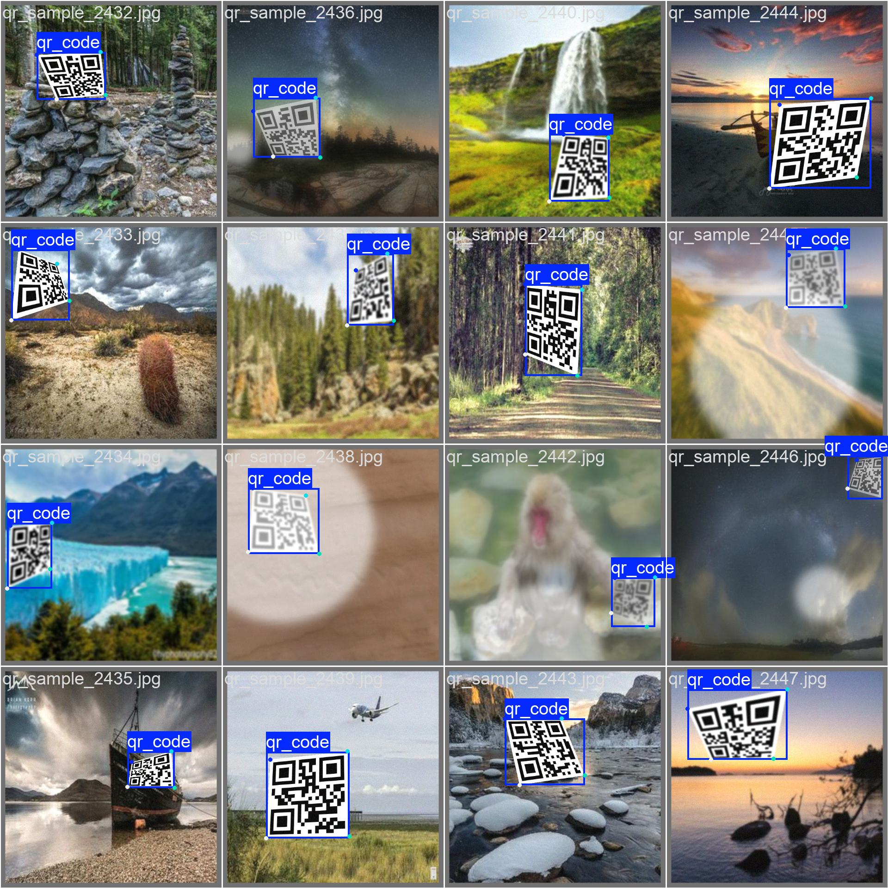

# QR Code Navigation System for Orange Pi 5 (NPU Accelerated)

Проект системы компьютерного зрения для автономного робота-сборщика. Использует нейросеть YOLOv8-Pose, работающую на аппаратном ускорителе (NPU) чипа RK3588.

## 🚀 Особенности
- **Высокая производительность:** 30+ FPS на Orange Pi 5 благодаря NPU.
- **Интеллектуальная детекция:** Находит QR-коды под сильными углами и в сложных условиях освещения.
- **Геометрическая коррекция:** Автоматическое выпрямление (Perspective Transform) по 4 ключевым точкам для безошибочного чтения.
- **Оптимизация:** Перевод модели из PyTorch (.pt) -> ONNX -> RKNN.
## 📊 Визуализация результатов

Ниже представлены примеры работы нейросети. Слева — исходная разметка, справа — предсказания модели на валидационной выборке.

| Исходная разметка (Labels) | Предсказания YOLOv8 (Predictions) |
|:---:|:---:|
|  |  |

Модель демонстрирует высокую точность (Confidence 1.0) в определении как самой рамки (Bounding Box), так и ключевых точек (Keypoints) углов QR-кода.
## 🛠 Стек технологий
- **Hardware:** Orange Pi 5 (RK3588), MIPI Camera / USB Webcam.
- **AI Model:** YOLOv8-pose (Nano).
- **Inference:** RKNN-Toolkit2, RKNN-Toolkit-Lite2.
- **Libraries:** OpenCV, NumPy, PyZbar.

